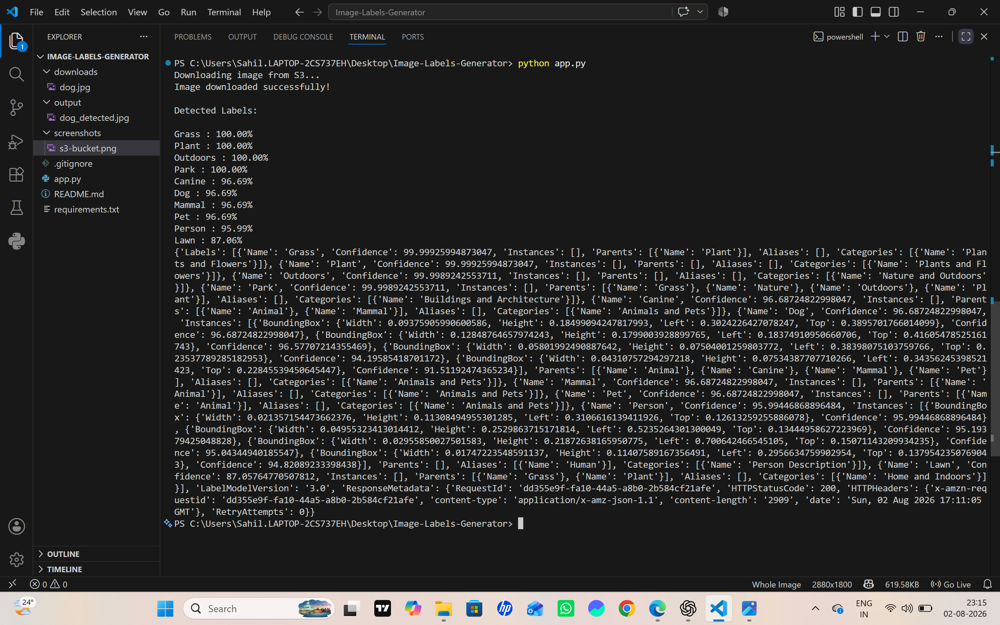

# AWS Image Labels Generator using Amazon Rekognition

## 📌 Project Overview

This project is a Python-based application that uses **Amazon Rekognition** to detect objects in an image.

The application downloads an image from an **Amazon S3 bucket**, sends it to **Amazon Rekognition** for object detection, prints the detected labels with confidence scores, draws bounding boxes around the detected objects, and saves the processed image locally.

---

## 🏛️ Architecture


## 🚀 Features

- Download image from Amazon S3
- Detect objects using Amazon Rekognition
- Display object labels with confidence score
- Draw bounding boxes on detected objects
- Save processed image
- Display processed image

---

## 🛠️ Technologies Used

- Python
- Amazon S3
- Amazon Rekognition
- AWS IAM
- AWS CLI
- boto3
- Pillow

---

## 📂 Project Structure

```text
aws-image-labels-generator/
│
├── app.py                  # Main Python application
├── requirements.txt         # Project dependencies
├── README.md               # Project documentation
├── .gitignore              # Git ignore rules
├── downloads/
│   └── dog.jpg             # Downloaded image from S3
├── output/
│   └── dog_detected.jpg    # Processed image with bounding boxes
```

---

## ⚙️ Installation

### 1. Clone the repository

```bash
git clone https://github.com/sahilp16092004-rgb/aws-image-labels-generator.git
```

### 2. Move into the project folder

```bash
cd aws-image-labels-generator
```

### 3. Install dependencies

```bash
pip install -r requirements.txt
```

### 4. Configure AWS CLI

```bash
aws configure
```

Enter:

- AWS Access Key ID
- AWS Secret Access Key
- Region (Example: us-east-1)
- Output format: json

### 5. Run the application

```bash
python app.py
```
---

## 🏗️ Project Workflow

1. Upload an image to an Amazon S3 bucket.
2. Python connects to AWS using boto3.
3. The application downloads the image from S3.
4. Amazon Rekognition analyzes the image.
5. Detected labels and confidence scores are returned.
6. Bounding boxes are drawn on the detected objects.
7. The processed image is saved in the `output` folder and displayed.

---

## 📸 Screenshots

### Original Image


---

### Terminal Output



---

### Final Output


